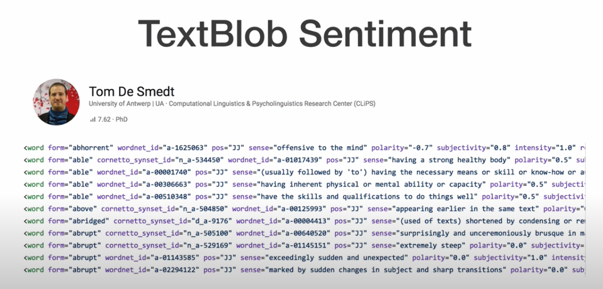
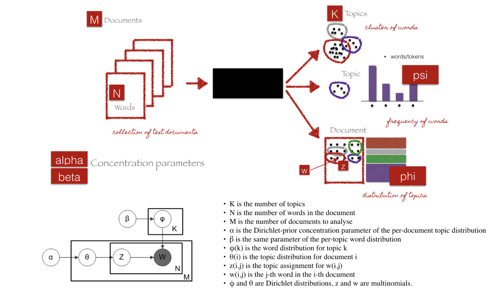
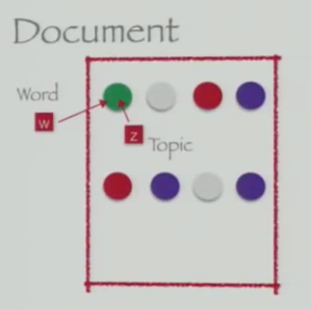
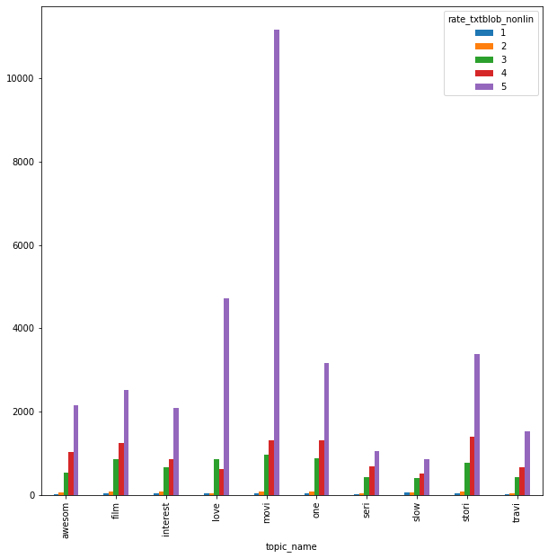
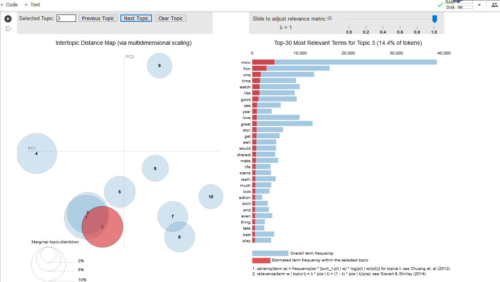
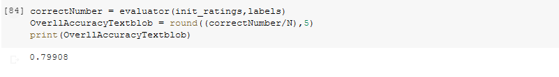

# aspect_based sentiment DSS

 
0) Introduction and purpose 
0.1) Setups and input, output format and data frame clarification 
	0.2) Purposes  
 
Part 1) Preprocessing the data and preparing it 
	1.1) cleaning Data 
	1.2) vectorizing  
 
Part 2) Phase One ( Finding Sentiments)   
	2.1) Unsupervised approach with “textblob” library 
		2.1.1) Estimating Sentiments 
		2.1.2) Extrapolating ratings  
 
 
part 3) Phase Two ( Extracting Topics or Aspects) 
	3.0) Training LDA model  
	3.1) Finding soft/fuzzy clustering of words  
	3.2) Finding words distribution for each Topic 
	3.3) Finding Topics-distribution for each document 
 
part 4) Evaluations and visualizations  
	4.1) visualizing topic-sentiment graph of corpus  
	4.2) Evaluating and visualizing LDA method 
	4.3)  Evaluating and visualizing “textblob” method
 

----------------------

1. (Part 1) Preprocessing the data and preparing it
	1. cleaning data: We go through following steps:
		1.	removing user names
		2.	removing numbers
		3.	removing URLs
		4.	removing punctuations
		5.	removing stopwords
		6.	removing words with length less than 3
		7.	transform to the lower case
		8.	stemming
	2) vectorizing
2. (Phase One) Finding Sentiments (textblob approach)

In a nut shell, TextBlob library has unsupervised methods for finding polarity and subjectivity (and etc) of a text. A lot of linguists, namely Tom De Smedt, have come together and have figured out all different aspect of words manually. Based on this great job that has done recently, we are able to estimate polarity (means sentiment score that is between -1 and +1) even better than KNN or Bayes which have expensive calculation. In our case, we have reached 0.799 percent accuracy for estimating polarity (sentiment) of reviews. We will explain this in “Evaluation of TextBlob” part.(More info about textblob for interested reader, perhaps you!, : [Link#1](https://medium.com/analytics-vidhya/natural-language-processing-to-evaluate-english-newspapers-for-vocab-facts-vs-opinions-ebe9cb30942d) , [Link#2](https://textblob.readthedocs.io/en/dev/_modules/textblob/en/parsers.html))  

Estimating Sentiments: 
We help of polarity function we can easily find sentiment score and map it to {Pos , Neg , Neu}. 

Extrapolating ratings:  
For finding ratings we need to extrapolate them with respect to current behavior of users. For this purpose, beside defining a linear map from sentiment score to {1,2,3,4,5}, we define a non-linear function that is trained by ratings distribution of the reviews in data set.  

3. (Phase Two) Extracting Topics/Aspects
At first, we explain what is exactly the problem? 

As an input we receive M document. Then we pass them into the black box that is LDA (hopefully it will not remain black box after this explanations) then we do some works (that will be explained in 3.0). As an output we have 3 things: 
	1) soft/fuzzy clustering of words , 
	2) words distribution for each Topic ,
	3) Topics-distribution for each document

+ Training LDA model 
This is an iterative algorithm with the following steps:  
+ Initialize parameters ( M, N , K , iterative steps, alpha , beta ,…) 
+ Initialize topic assignments randomly 
 
+ Iterate:  
	for each word in each document: 
	Resample topics for words, given all words and their current topic assignments 
+ getting the results  

4. Evaluations and visualizations 
	0. visualizing topic-sentiment graph of corpus  
	1.  
	2. Evaluating and visualizing LDA method 
	3.  
	4. Evaluating and visualizing “textblob” method 
	5.  

I sincerely appreciate your time and your insightful comments. 
Thanks.  

